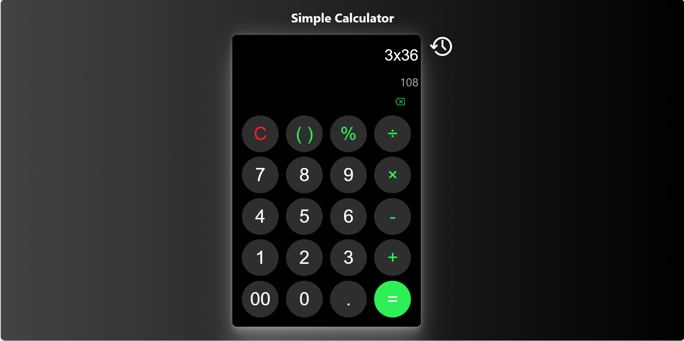
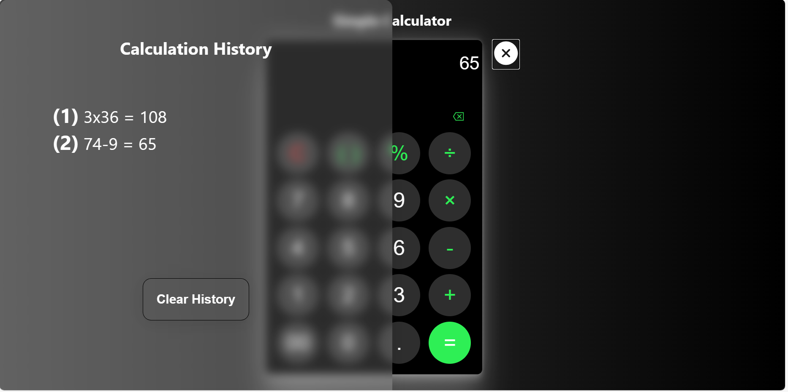
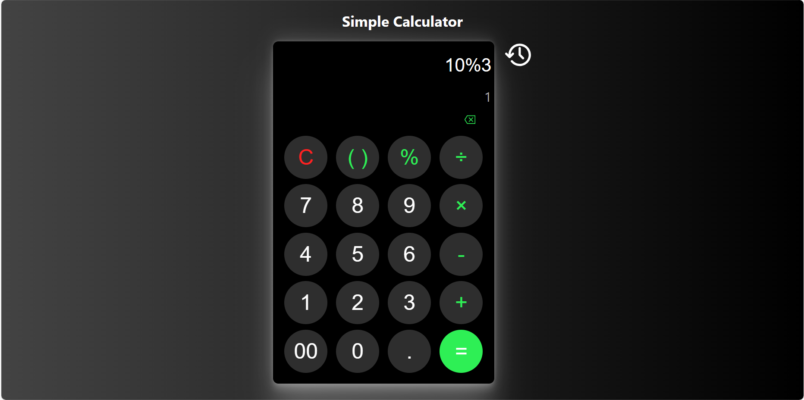

# Simple Calculator

This is a basic calculator application built using React. It provides functionality for performing arithmetic calculations, evaluating expressions, and maintaining a calculation history.

## Features

- Perform addition, subtraction, multiplication, and division.
- Evaluate mathematical expressions using the 'eval' function from the 'mathjs' library.
- Support for parentheses and percentage calculations.
- History functionality to display past calculations.

## Technologies Used

- React
- JavaScript (ES6+)
- HTML
- CSS
- mathjs library

## Installation

1. Clone the repository:

   git clone https://github.com/the-Sunny-Sharma/Mira_SimpleCalculator.git

2. Navigate to the project directory:

    cd calculator

3. Install dependencies:

    npm install

## Usage

1. Start the application:

    npm start

2. Open the application in your browser by navigating to http://localhost:3000.

3. Use the calculator interface to perform calculations, enter expressions, and view the calculation history.

## Screenshots

*This screenshot shows the main interface of the calculator, highlighting the input field and the arithmetic operations available.*

*In this screenshot, the calculator's history panel is visible, displaying a list of past calculations performed by the user.*

*The third screenshot demonstrates the usage of the percentage calculation feature, where a percentage value is computed based on the entered expression.*

## Contributing

Contributions are welcome! If you'd like to contribute to this project, feel free to submit a pull request.

This README.md includes sections detailing features, technologies used, installation steps, usage instructions, and information on contributing to the project. You can further enhance or customize this content as needed for your project.

## License

This project is licensed under the [MIT License](LICENSE).

